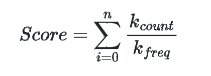

```text
    ____  _      _____                      __
   / __ \(_)____/ ___/___  ____ ___________/ /_
  / / / / / ___/\__ \/ _ \/ __ `/ ___/ ___/ __ \
 / /_/ / / /   ___/ /  __/ /_/ / /  / /__/ / / /
/_____/_/_/   /____/\___/\__,_/_/   \___/_/ /_/ 
                                                v1.0.0
```

## Introduction

DirSearch is a search engine for PDF documents. 
What makes it special is that it is made for searching data across any number of PDF files that reside in the same folder.
It accepts one or more keywords and returns a list of pages with the most related content, akin Google Search or other search engines.

## Getting Started

### Installation
To try out DirSearch follow these steps:
- Download the latest version of Rust following [this guide](https://www.rust-lang.org/tools/install)
- Download this repository
- Navigate to the repo directory
- Run ```cargo  build --release```
- Create a shell script to run DirSearch
```shell
fn dirsearch() {
    {path to the repo}/DirSearch/target/release/DirSearch $@
}
```
- Add the created script to your shell configuration file (in my case, ~/.zshrc)

### Tutorial
DirSearch is very easy to use. Move all the PDFs you want to search among in a folder and navigate there in your terminal.


Run ```dirsearch search .```.
This will create an index and open search menu. Enter one or more keywords divided by space. 
You will be shown top five results, from most to least relevant. The search engine has granularity of one page.
To search again, input an enter. To exit input ```exit``` in the search field. 

In case you add, modify or delete one or more of the PDFs, you would likely want to rebuild the index.
For that, run ```dirsearch index-rebuild .```

In all the aforementioned commands ```.``` is a pointer to the current directory. It is possible to access a directory other than the one you are running the command from. 

## Index

DirSearch builds a reverse index for the data from every document. This is a popular technique that drastically improves performance.
The index is persisted using LMDB - an embedded key-value database that is stored in the directory with all the provided PDFs. 

## Pre-processing

There are a few steps that are taken before adding a word to the index:
- Elimination of [stopwords](src/resources/stop-words.txt). Stopwords are the words that don't bear any meaning by themselves. Examples: the, a, him, she, I, is, are.
- [Stemming](https://en.wikipedia.org/wiki/Stemming) - I use [rust-stemmers](https://github.com/CurrySoftware/rust-stemmers) library for it

## Frequency counter
Every word stored in the index has a frequency counter as well. 
This helps to identify some unique words that are easy to spot. 

Let me give you an example. While testing, I used 9 presentations from my Robotics course for the input. 
Word "Robot" and derivatives have around 100 mentions while word "Kinematic" is used twice as rarely. 
In a case when search keywords include both "Robot" and "Kinematic", the latter is given priority.  

### Score
In order to numerically estimate which page is best suited, each is provided a score relative to the search keywords.
It is calculated as follows:



Where n is the number of keywords, k_count is the number of occurrences of a keyword on the page, 
and k_freq is the aforementioned **frequency counter**.